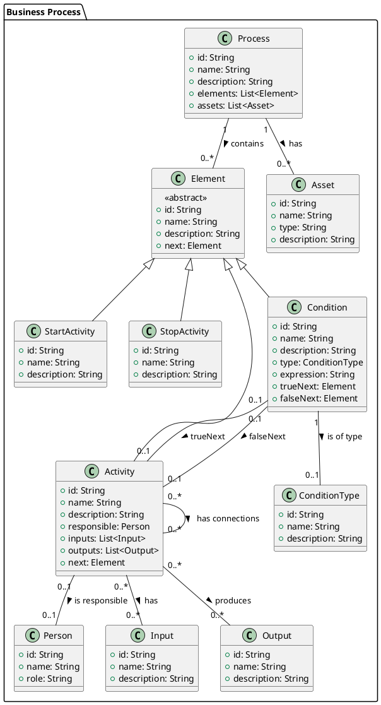

# Class Diagram

```plantuml
@startuml
package "Business Process" {
  class Process {
    +id: String
    +name: String
    +description: String
    +elements: List<Element>
    +assets: List<Asset>
  }

  class Element {
    <<abstract>>
    +id: String
    +name: String
    +description: String
    +next: Element
  }

  class StartActivity {
    +id: String
    +name: String
    +description: String
  }

  class StopActivity {
    +id: String
    +name: String
    +description: String
  }

  class Activity {
    +id: String
    +name: String
    +description: String
    +responsible: Person
    +inputs: List<Input>
    +outputs: List<Output>
    +next: Element
  }

  class Condition {
    +id: String
    +name: String
    +description: String
    +type: ConditionType
    +expression: String
    +trueNext: Element
    +falseNext: Element
  }

  class ConditionType {
    +id: String
    +name: String
    +description: String
  }

  class Asset {
    +id: String
    +name: String
    +type: String
    +description: String
  }

  class Person {
    +id: String
    +name: String
    +role: String
  }

  class Input {
    +id: String
    +name: String
    +description: String
  }

  class Output {
    +id: String
    +name: String
    +description: String
  }

  Process "1" -- "0..*" Element : contains >
  Element <|-- StartActivity
  Element <|-- StopActivity
  Element <|-- Activity
  Element <|-- Condition
  Condition "1" -- "0..1" ConditionType : is of type >
  Activity "0..1" -- "0..1" Person : is responsible >
  Activity "0..*" -- "0..*" Input : has >
  Activity "0..*" -- "0..*" Output : produces >
  Process "1" -- "0..*" Asset : has >
  Activity "0..*" -- "0..*" Activity : has connections >
  Condition "0..1" -- "0..1" Activity : trueNext >
  Condition "0..1" -- "0..1" Activity : falseNext >
}
@enduml
```
